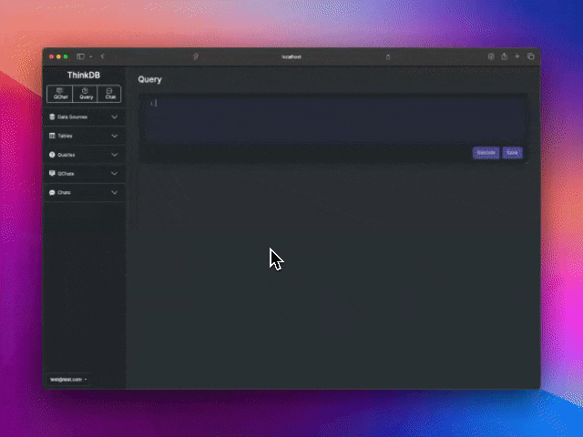

<div align="right">
<a href="https://discord.com/invite/your-discord-server-id" style="float: right;"></a>
</div>
<h1 align="center">
ThinkDB 🤔
</h1>

<h3 align="center">
ThinkDB is a powerful SQL client that transforms the way you interact with your databases.
</h3>

---

**Smart Query Interface:** Write SQL queries effortlessly with our normal query interface enhanced by smart code completion, helping you code faster and with fewer errors.

<div align="center">

</div>


---

**QChat:** Engage in a conversational dialogue with our AI assistant. Simply ask questions in natural language, and QChat responds with precise SQL queries and real-time data results.

---

**Virtual DBA Chat:** Consult with an AI-powered virtual Database Administrator capable of performing tasks that a seasoned DBA would handle. Need to optimize queries, set up database backups, configure security settings, or get performance tuning advice? The virtual DBA is here to assist you.

---

Whether you’re an experienced database professional or just starting out, ThinkDB provides an intuitive and natural interface to explore, query, and manage your data with unparalleled ease.


---
Looking for CLI version? Checkout our powerful range of AI powered CLI Tools 👉 [CommandAI](https://github.com/ThinkThinkAI/CommandAI)

---

## Current Features

- **Multi-Database Support:** Seamlessly interact with SQLite, MySQL, and PostgreSQL databases, all from a single unified interface.
- **Intelligent SQL Autocompletion:** Experience faster query writing with smart autocompletion in the SQL editor, reducing errors and improving efficiency.
- **AI-Driven SQL Generation:** Generate complex SQL queries from simple natural language inputs, allowing you to articulate your needs without getting bogged down in syntax.
- **Query Management:** Save and organize your frequently used queries, enabling quick access and reuse for future sessions.
- **Table Browser:** Explore your database structures with a robust table browser that offers insights into table schemas and relationships.
- **AI-Powered Database Optimization:** You are able to consult our AI for guidance on optimizing your database schema and structure, making your database more efficient and scalable.

## Upcoming Features

- **Expanded Database Support:** We are actively working to broaden the range of supported databases, ensuring compatibility with more systems.
- **User Administration:** Enhanced user management capabilities will be introduced, allowing for more granular control over access and permissions.

## Security Considerations

- **Privacy by Design:** Only database schemas are sent to the AI for processing—no actual table data is transmitted, ensuring the confidentiality of your information.
- **Principled Approach:** We believe that offering database clients as a service poses significant security risks; therefore, ThinkDB is designed to operate securely on your own infrastructure.
- **Encrypted Communication:** All connection information is securely encrypted, safeguarding your credentials and ensuring that your data remains protected at all times.
- **Database Security:** We believe database security should be managed on the database itself, reinforcing access controls and preventing unauthorized access.

## Getting Started

### Using Docker (The Simplest Method)

To get ThinkDB up and running quickly using DockerHub:

### Running the Application

1. Pull the latest Docker image:

    ```sh
    docker pull thinkthinkai/think_db:latest
    ```

2. Run the container while ensuring SQLite database persistence and setting the `SECRET_KEY_BASE` environment variable. Remember to replace `directory_on_your_machine_for_think_db_storage` and `your_secret_key_base_here` with your actual directory path and secret key base:

    ```sh
    # change directory_on_your_machine_for_think_db_storage & your_secret_key_base_here
    docker run -d -p 3000:3000 -v directory_on_your_machine_for_think_db_storage:/app/storage -e SECRET_KEY_BASE=your_secret_key_base_here thinkthinkai/think_db:latest
    ```

### Using Rails Outside a Container (The Harder Method)

To run ThinkDB locally using Rails:

### Prerequisites

Before you start, ensure you have the following installed:

- Ruby (version 3.2.2 or higher)
- Rails (version 7.1 or higher)
- Bundler
- Redis (for Action Cable / Sidekick)

### Steps to Run ThinkDB Outside a Container

1. Clone the repository:

    ```bash
    git clone https://github.com/ThinkThinkAI/ThinkDB.git
    cd ThinkDB
    ```

2. Install the necessary gems:

    ```bash
    bundle install
    ```

3. Set up the database:

    ```bash
    bin/rails db:setup
    ```

4. Start the application with the `SECRET_KEY_BASE` environment variable set:

    ```bash
    SECRET_KEY_BASE=$(bundle exec rake secret) foreman start
    ```
