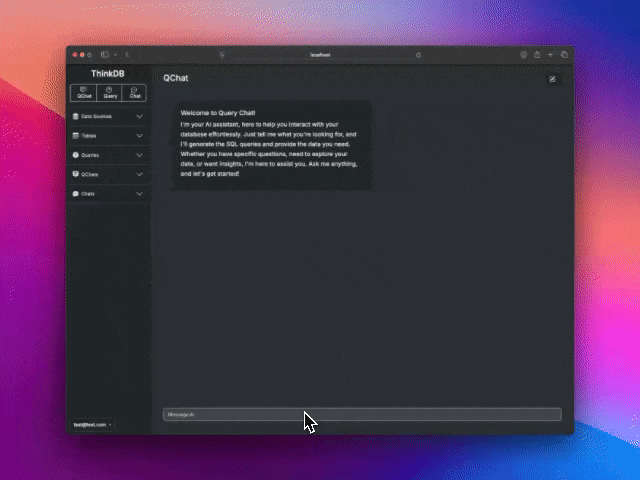
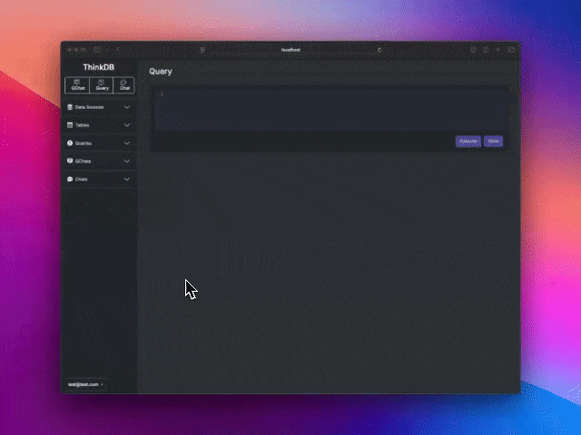
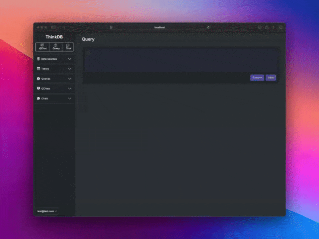

<div align="right">
<a href="https://discord.com/invite/your-discord-server-id" style="float: right;"></a>
</div>
<h1 align="center">
ThinkDB 🤔
</h1>

<h3 align="center">
ThinkDB is a powerful SQL client that transforms the way you interact with your databases.
</h3>

---

**Smart Query Interface:** Write SQL queries effortlessly with our query interface enhanced by smart code completion, helping you code faster and with fewer errors.

<div align="center">

</div>

---

**QChat:** Engage in a conversational dialogue with our AI assistant. Simply ask questions in natural language, and QChat responds with precise SQL queries and real-time data results.

<div align="center">

</div>

---

**Virtual DBA Chat:** Consult with an AI-powered virtual Database Administrator capable of performing tasks that a seasoned DBA would handle. Need to optimize queries, set up database backups, configure security settings, or get performance tuning advice? The virtual DBA is here to assist you.

<div align="center">

</div>

---

Whether you’re an experienced database professional or just starting out, ThinkDB provides an intuitive and natural interface to explore, query, and manage your data with unparalleled ease.


---
Looking for CLI version? Checkout our powerful range of AI powered CLI Tools 👉 [CommandAI](https://github.com/ThinkThinkAI/CommandAI)

---

---

## Current Features

- **Multi-Database Support:** Seamlessly interact with SQLite, MySQL, and PostgreSQL databases, all from a single unified interface.
- **Intelligent SQL Autocompletion:** Experience faster query writing with smart autocompletion in the SQL editor, reducing errors and improving efficiency.
- **AI-Driven SQL Generation:** Generate complex SQL queries from simple natural language inputs, allowing you to articulate your needs without getting bogged down in syntax.
- **Query Management:** Save and organize your frequently used queries, enabling quick access and reuse for future sessions.
- **Table Browser:** Explore your database structures with a robust table browser that offers insights into table schemas and relationships.
- **AI-Powered Database Optimization:** You are able to consult our AI for guidance on optimizing your database schema and structure, making your database more efficient and scalable.

## Upcoming Features

- **Expanded Database Support:** We are actively working to broaden the range of supported databases, ensuring compatibility with more systems.
- **User Administration:** Enhanced user management capabilities will be introduced, allowing for more granular control over access and permissions.

## Security Considerations

- **Privacy by Design:** Only database schemas are sent to the AI for processing—no actual table data is transmitted, ensuring the confidentiality of your information.
- **Principled Approach:** We believe that offering database clients as a service poses significant security risks; therefore, ThinkDB is designed to operate securely on your own infrastructure.
- **Encrypted Communication:** All connection information is securely encrypted, safeguarding your credentials and ensuring that your data remains protected at all times.
- **Database Security:** We believe database security should be managed on the database itself, reinforcing access controls and preventing unauthorized access.
- **Custom AI Provider:** Select the AI provider that best suits your needs or host your own AI system, giving you complete control over the AI integration and ensuring it complies with your security policies.

## ⚠️ Alpha Version Warning

Please note that ThinkDB is currently in its alpha stage. While we are continuously working to improve and stabilize the application, you may encounter bugs. We appreciate your understanding and welcome any feedback to help us enhance the product.

---

## Getting Started

### Using Docker (The Simplest Method)

To get ThinkDB up and running quickly using DockerHub:

### Running the Application

1. Pull the latest Docker image:

    ```sh
    docker pull thinkthinkai/think_db:latest
    ```

2. Run the container while ensuring SQLite database persistence and setting the `SECRET_KEY_BASE` environment variable. Remember to replace `directory_on_your_machine_for_think_db_storage` and `your_secret_key_base_here` with your actual directory path and secret key base:

    ```sh
    # change directory_on_your_machine_for_think_db_storage & your_secret_key_base_here
    docker run -d -p 3000:3000 -v directory_on_your_machine_for_think_db_storage:/app/storage -e SECRET_KEY_BASE=your_secret_key_base_here thinkthinkai/think_db:latest
    ```
    
### Security Note

It's outside the scope of this README to walk you through securing your Docker container and any web application you host within it. However, we strongly recommend that:

1. **SECRET_KEY_BASE**: This should be managed securely—preferably through Docker secrets if using Docker Swarm or Kubernetes, or via a trusted secret management solution—to ensure it’s not exposed in plaintext within your environment variables.
2. **TLS/SSL**: Always serve your web application over HTTPS using a valid TLS certificate to encrypt data transmitted over the network.


### Using Rails Outside a Container (The Harder Method)

To run ThinkDB locally using Rails:

### Prerequisites

Before you start, ensure you have the following installed:

- Ruby (version 3.2.2 or higher)
- Rails (version 7.1 or higher)
- Bundler
- Redis (for Action Cable / Sidekick)

### Steps to Run ThinkDB Outside a Container

1. Clone the repository:

    ```bash
    git clone https://github.com/ThinkThinkAI/ThinkDB.git
    cd ThinkDB
    ```

2. Install the necessary gems:

    ```bash
    bundle install
    ```

3. Set up the database:

    ```bash
    bin/rails db:setup
    ```

4. Start the application with the `SECRET_KEY_BASE` environment variable set:

    ```bash
    SECRET_KEY_BASE=$(bundle exec rake secret) foreman start
    ```

## Configuration

ThinkDB is highly configurable to suit your needs. Below are the steps to configure it properly:

### AI Configuration

You can configure the AI services ThinkDB uses to generate and optimize SQL by setting the AI URL, model, and API key. This can be done via the Settings interface in the application.

#### Steps:
1. **Navigate to the Settings Page**

2. **Fill in AI Service Information**:
   - **AI URL**: URL to connect to the AI service.
   - **AI Model**: Specify the model name.
   - **AI API Key**: Enter your API key for the AI service.

<div align="center">

</div>

Here's an example of how you can configure for various AI services:

- **ChatGPT**:
  - **URL**: `https://api.openai.com/v1`
  - **Model**: [OpenAI Models](https://beta.openai.com/docs/models)
  - **API Key**: [Generate API Key](https://beta.openai.com/account/api-keys)

- **Mistral**:
  - **URL**: `https://api.mistral.ai/v1/completions`
  - **Model**: [Mistral Models](https://mnt9s.ai/models)
  - **API Key**: [Generate API Key](https://mistral.ai/account/api-keys)

- **Ollama**:
  - **URL**: `http://127.0.0.1:11434` (if running locally)
  - **Model**: Depends on installed models.
  - **API Key**: Any valid key.

- **OpenAI Compatible**:
  - ThinkDB can connect to any AI service that implements OpenAI's API, including Azure OpenAI, Anthropic, Cohere, and others. Check their documentation for proper URL, model, and API key.

### Data Source Configuration

Proper configuration ensures that ThinkDB can interact with your databases efficiently:

#### Steps:
1. **Navigate to New Data Source**: 

2. **Fill in Data Source Information**:
   - **Data Source Name**: Provide a friendly name for the data source.
   - **Database Type**: Select from SQLite, MySQL, PostgreSQL, etc.
   - **Connection Details**: Provide necessary credentials and connection string.

<div align="center">

</div>

   - You can create multiple data sources.
   - Only one data source can be active at a time.
   - Change active data source at any time from the left navigation bar.

### Reporting Issues

If you encounter any bugs or have suggestions for improvements, please open an issue on the GitHub repository. To help us understand and address the issue, please include the following information:

1. **Description**: Provide a clear and concise description of the bug or feature request.

2. **Steps to Reproduce**: List the steps needed to reproduce the bug. This is crucial for us to identify and fix the problem.

3. **Expected Behavior**: Explain what you expected to happen.

4. **Actual Behavior**: Describe what actually happened. Include any error messages or logs if applicable.

5. **Environment**: Provide details about your environment, such as the operating system, browser, and versions of any relevant libraries and tools.

Example:

```markdown
**Description**:
The application crashes when I try to add a new data source.

**Steps to Reproduce**:
1. Navigate to the 'New Data Source' page.
2. Fill in the details and click 'Save'.
3. Application crashes.

**Expected Behavior**:
The new data source should be saved without any issues.

**Actual Behavior**:
The application crashes with an 'Internal Server Error'.

**Environment**:
- OS: Windows 10
- Browser: Google Chrome Version 93.0.4577.63
- ThinkDB Version: 1.2.3
```

Including these details will help us resolve issues more quickly. Thank you for helping us improve ThinkDB!